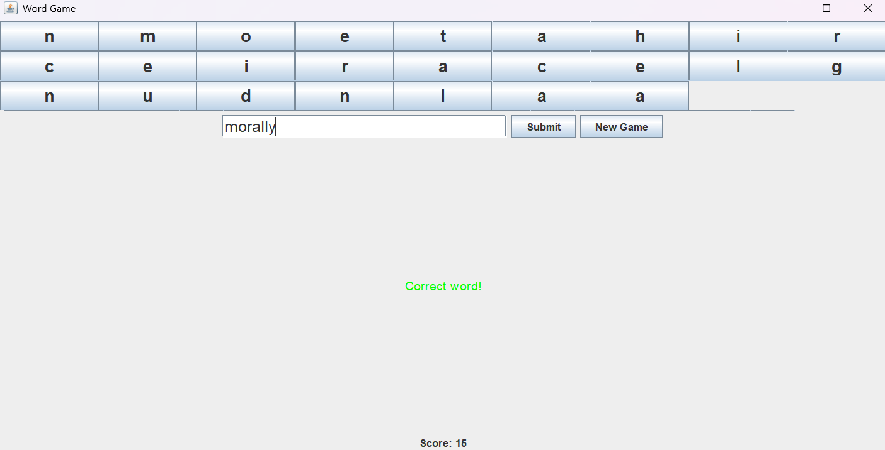

# Word Game Application

A Java-based  application where users form words from random letters to score points. The game is implemented using `Swing` for the frontend, custom backend logic for word validation, and `MySQL` for the database to store and retrieve words.

## Features
- Random letter generation for forming words.
- Validation of submitted words against a predefined list stored in MySQL.
- Dynamic scoring based on word length.
- Option to start a new game.

## Technologies Used
- **Java Swing**: For the graphical user interface.
- **MySQL**: For storing the list of valid words.
- **Custom Backend Logic**: Handles word generation, validation

## How to Run
1. Clone the repository:
   ```bash
   git clone https://github.com/your-username/word-game.git
## Screenshots
### 1. Correct Word Example

